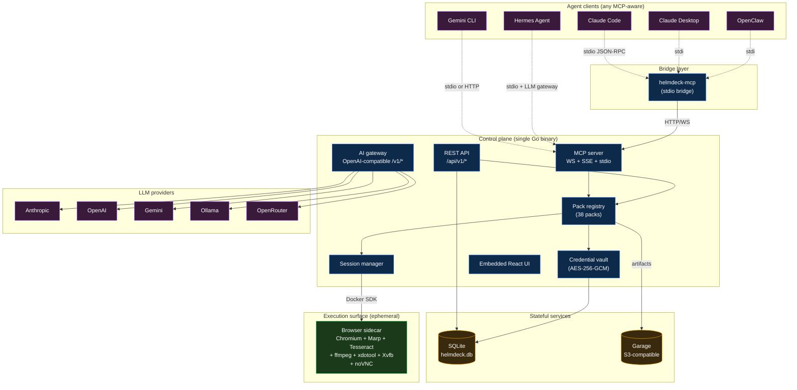
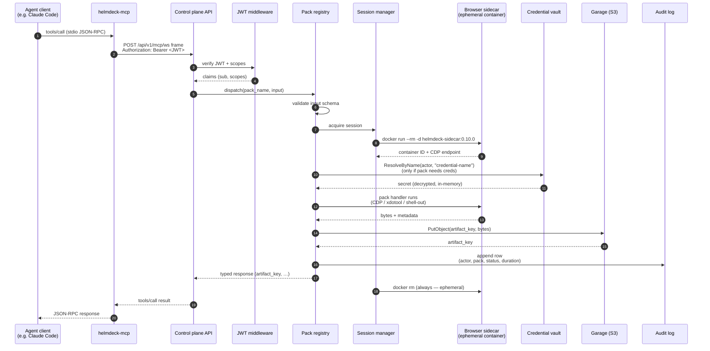
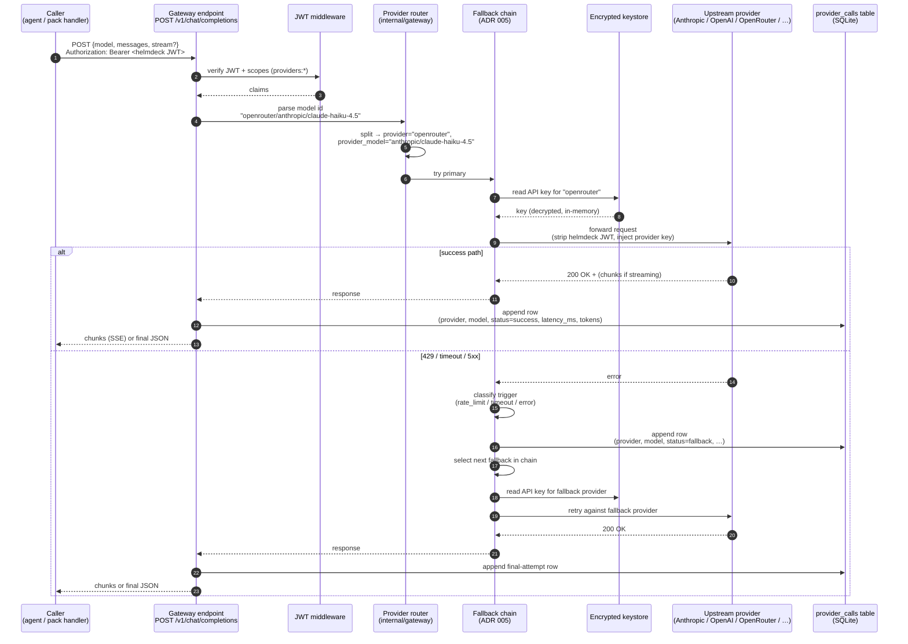
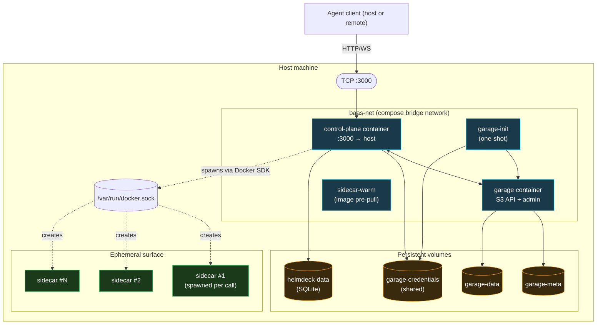
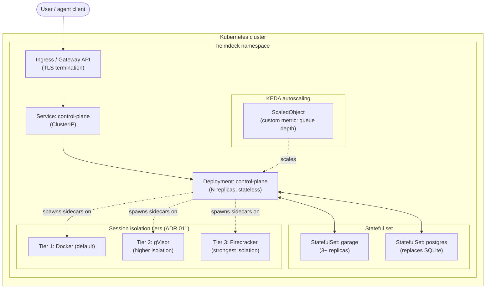
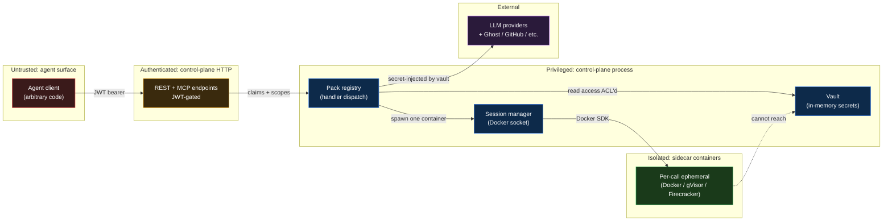
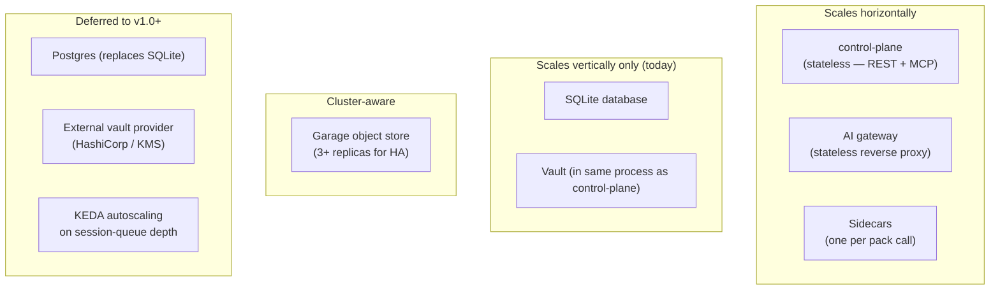

# Architecture overview

This page is the canonical architecture reference. It assumes the reader is an engineer or architect evaluating helmdeck for adoption — not a hands-on operator. For step-by-step setup, see the [tutorials](../tutorials/install-cli.md) and [how-to guides](../howto/index.md). For the *why* behind specific design decisions, see the [Architecture Decision Records](./adrs).

Five views, each answering a question architects ask first:

1. **What are the pieces?** — System components
2. **What happens on a tool call?** — Request flow
3. **Where does it run?** — Deployment topology
4. **What's the security shape?** — Trust boundaries
5. **What scales?** — Capacity and concurrency model

---

## 1. System components

The platform is two binaries plus an isolated execution surface and a small set of stateful services.

**Key facts for evaluators:**

| Component | Process | Persistence | Scaling unit |
|---|---|---|---|
| `control-plane` | Single Go binary | SQLite + Garage | Horizontal (stateless API; sticky sessions for MCP) |
| `helmdeck-mcp` | Per-client subprocess | None | One per agent client |
| Browser sidecar | Per pack call | None (ephemeral) | One container per call, recycled after |
| Garage | Container | Object store | Cluster-aware (3-node minimum for HA) |
| SQLite | File on local disk | Audit, vault, sessions | Single-node today; Postgres planned (ADR 009) |

The control plane is the **only** thing your agents talk to. Sidecars don't accept inbound traffic; agents don't reach Garage; LLMs don't see your raw prompts directly (everything routes through the gateway, which strips/injects credentials and writes audit rows).

---

## 2. Request flows

Helmdeck has two distinct request flows that architects must understand independently:

- **2.a — Pack call (MCP)** — an agent invokes a capability pack via the MCP server. This is the primary way agents *do work* with helmdeck.
- **2.b — LLM gateway** — an agent (or a workflow inside helmdeck) calls a chat-completion endpoint that helmdeck proxies to one of several upstream providers, with key injection, fallback, and observability. This is helmdeck-as-OpenAI-compatible-gateway.

Most clients use both flows in the same session — Hermes, for example, routes its LLM calls through 2.b and its tool calls through 2.a, so helmdeck observes both layers.

### 2.a Pack call (MCP) — one pack call, end to end

This is what happens when an agent runs `helmdeck__browser-screenshot_url(url=https://example.com)`.

**Why this shape matters:**

- **Step 7 (input schema validation) runs before any side effect.** A malformed call returns a typed error code without spinning up a container or touching a credential.
- **Step 11 (vault resolve) is gated by per-credential ACLs** — the calling subject must have read access to the named credential. The credential value never leaves the control-plane process.
- **Step 16 (audit append) is unconditional** — succeeded or failed, every pack call leaves an audit row. This is the source of truth for compliance.
- **Step 17 (session destroy) is unconditional** — sidecars are *single-use*. There is no shared browser state between calls; no escape from one pack call into another.

### 2.b LLM gateway — one chat completion, end to end

This is what happens when an agent or a helmdeck pack handler issues `POST /v1/chat/completions` with `model: "openrouter/anthropic/claude-haiku-4.5"`. The gateway is OpenAI-compatible — any OpenAI SDK pointed at `http://localhost:3000/v1` works without code changes.

**Why this shape matters:**

- **Step 1 carries the helmdeck JWT, never the provider key.** The agent doesn't see the upstream credential; the keystore decrypts it inside the control-plane process and injects it into the outbound request. This is the same trust pattern the vault uses for pack credentials (§4 below).
- **Step 5 (model-id parse) is the dispatch surface.** Models follow `provider/model` form (e.g. `openrouter/anthropic/claude-haiku-4.5`, `ollama/llama3.1:8b`, `anthropic/claude-sonnet-4.6`). The first segment is the provider; the rest is what gets forwarded to that provider's own `model` field. Mis-routing a model id surfaces as a clean 400, not a 502 from the wrong upstream.
- **Steps 11–14 are the fallback machinery (ADR 005).** Three triggers are supported in the closed set: `rate_limit` (HTTP 429), `timeout` (request-context deadline hit), `error` (any other non-timeout, non-429 failure including 5xx and provider auth errors). An empty `triggers` slice on a fallback rule means *advance on anything*. Fallbacks are tried in order; the first one that succeeds wins.
- **Every attempt writes a `provider_calls` row** — the success row, every fallback hop, the final outcome. The **AI Providers → Model Success Rates** UI panel (T607) reads this table; it's how operators see which providers are flapping and whether their fallback rules are firing.
- **Streaming is end-to-end.** If the caller sets `stream: true`, the gateway forwards SSE chunks from the upstream as they arrive. The fallback machinery only kicks in on connection-level errors before the first chunk; once chunks start flowing, an upstream stream error surfaces to the caller as a partial response rather than a fallback retry (architecturally — you can't un-emit tokens to the caller).
- **`provider_calls` is the heaviest-write table in the system.** Plan SQLite size accordingly: ~3 rows per chat completion (1 attempt + maybe 2 fallback rows), each row ~200 bytes. A workload doing 10k chat calls/day produces ~30k rows/day, ~10M rows/year — well within SQLite's comfort zone but worth knowing for capacity planning.

**The endpoints helmdeck-as-gateway exposes:**

| Endpoint | Purpose |
|---|---|
| `POST /v1/chat/completions` | OpenAI-compatible chat completion (this diagram) |
| `GET /v1/models` | List the models registered across all configured providers, in `provider/model` form |
| (provider-specific) | Helmdeck does NOT expose Anthropic-shape, Gemini-shape, or other native APIs; everything normalizes through the OpenAI shape |

If you need provider-native shapes (e.g. Anthropic's `/v1/messages` or Gemini's `generateContent`), point your client directly at the upstream — helmdeck's value here is the unified shape + key injection + fallback + audit, not as an Anthropic/Gemini compatibility shim.

---

## 3. Deployment topology

### Today — single-node Docker Compose

This is what `make install` produces. It's what every production install runs on as of v0.10.0.

**Topology constraints to know:**

- The control plane has **RW access to the host Docker socket**. This is how it spawns sidecars. It's a design trade-off (ADR 001) — operationally simple, but the control-plane process has root-equivalent host control. Run on a dedicated VM/host, not a multi-tenant box.
- **Only `:3000` is exposed to the host.** Garage, sidecars, and inter-service traffic all stay on the private compose bridge.
- **All persistent state lives in named Docker volumes** — `helmdeck-data`, `garage-meta`, `garage-data`, `garage-credentials`. Backup = volume snapshot.

### Coming in v1.0 — Kubernetes (Helm chart)

ADR 009 specifies the dual-tier deployment. Helm chart implementation is tracked in [Phase 7](../MILESTONES.md). Preview shape:

The shape is the same — just the substrate changes. Compose deploys can migrate without code changes; the control-plane binary is identical.

---

## 4. Trust boundaries

Where data crosses a privilege line, what enforces the boundary, and what's audited.

**Boundary-by-boundary:**

| From → To | Enforced by | Audited |
|---|---|---|
| Agent → API | JWT bearer + scope check (`packs:*`, `vault:*`, `mcp:*`, `sessions:*`, `providers:*`, `admin`) | Yes (audit log row per request) |
| API → Vault | Per-credential ACL (`actor_subject` × `actor_client` × wildcard `*`) | Yes (vault usage log: allowed / denied / no_match) |
| Registry → Sidecar | Docker SDK with constrained spec (CPU, memory, SHM, task cap, wall-clock timeout) | Yes (session lifecycle in audit log) |
| Sidecar → external services | **Agent never sees the credential.** Vault resolves secret in-process; injects via env or Authorization header; secret never appears in agent-visible logs or pack outputs | Yes (provider_calls table + audit row) |
| Sidecar → control-plane | **Not allowed.** Sidecars have no inbound network from `baas-net` to the control plane. Sidecars receive instructions via the Docker exec stream and write outputs to stdout/stderr, never via HTTP back to the control plane | n/a — boundary is structural |

**Threat model in one paragraph:** A compromised agent (or compromised LLM emitting bad tool calls) can do anything its JWT scopes allow. It cannot reach credentials it lacks ACLs for, cannot exfiltrate ones it does (the secret never leaves the control-plane process), cannot escape its sidecar (which has no inbound network), and every action is auditable. A compromised control-plane process is full game-over — *don't run helmdeck on a multi-tenant host*.

For a complete treatment, read [SECURITY-HARDENING.md](../SECURITY-HARDENING.md).

---

## 5. Scaling and concurrency

**What this means for capacity planning:**

- **One control-plane process** can handle dozens of concurrent MCP sessions and hundreds of pack calls/minute on a 4-core / 8 GB host. The bottleneck is sidecar spawn time (~500 ms-1.5 s per call, dominated by Docker startup), not CPU or memory in the control plane itself.
- **Sidecars dominate resource usage** — each browser sidecar is ~1 GB RAM at peak (Chromium). Plan host capacity around peak concurrent pack calls × 1 GB.
- **SQLite is the limit on a single-node Compose deploy.** Helm charts will replace it with Postgres so the control plane can scale horizontally. Until then, one control-plane process per database, vertical scaling only.
- **Audit log is the highest-write table.** A workload doing 10k pack calls/day produces ~10k audit rows + ~30k provider-call rows + ~40k vault-usage rows. SQLite handles this comfortably for years before needing migration.

---

## Loading order for evaluators

If you're an architect comparing helmdeck against alternatives, read in this order:

1. **This page** — system shape, request flow, security boundaries
2. **[Why helmdeck](../explanation/why-helmdeck.md)** — the cost-positioning argument and the structural reasons cheap models can do frontier work
3. **[ADRs 001–013](./adrs)** — the 13 core platform decisions (sidecar pattern, Go control plane, capability packs, AI gateway, MCP registry, vault, isolation tiers, observability)
4. **[Capability pack reference](./packs)** — the 38-pack catalog with input/output schemas
5. **[Security hardening](../SECURITY-HARDENING.md)** — the operational hardening checklist for a real deployment

If you're scoping a deployment:

- **Single-node trial** → [Install via the CLI](../tutorials/install-cli.md)
- **Production hardening** → [Security hardening](../SECURITY-HARDENING.md) + [Upgrade procedure](../howto/upgrade-helmdeck.md)
- **Multi-tenant or HA** → wait for v1.0 Helm chart (Phase 7) or sketch a custom Kubernetes deploy from the topology diagram above

---

## Source-of-truth pointers

The diagrams above are abstractions over the actual code. If a diagram and the code disagree, the code wins. Pointers for verification:

- Component shape: `cmd/control-plane/main.go`, `cmd/helmdeck-mcp/main.go`
- Request dispatch: `internal/mcp/server.go`, `internal/packs/registry.go`, `internal/packs/engine.go`
- Session lifecycle: `internal/session/types.go` + backend subpackages
- Auth: `internal/auth/jwt.go`
- Vault: `internal/vault/vault.go`
- Compose topology: `deploy/compose/compose.yaml`
- Architecture decisions: [`docs/adrs/`](./adrs)

If you spot a divergence, please [open an issue](https://github.com/tosin2013/helmdeck/issues/new) — the diagrams are versioned with the docs, so a stale diagram is a real defect.
